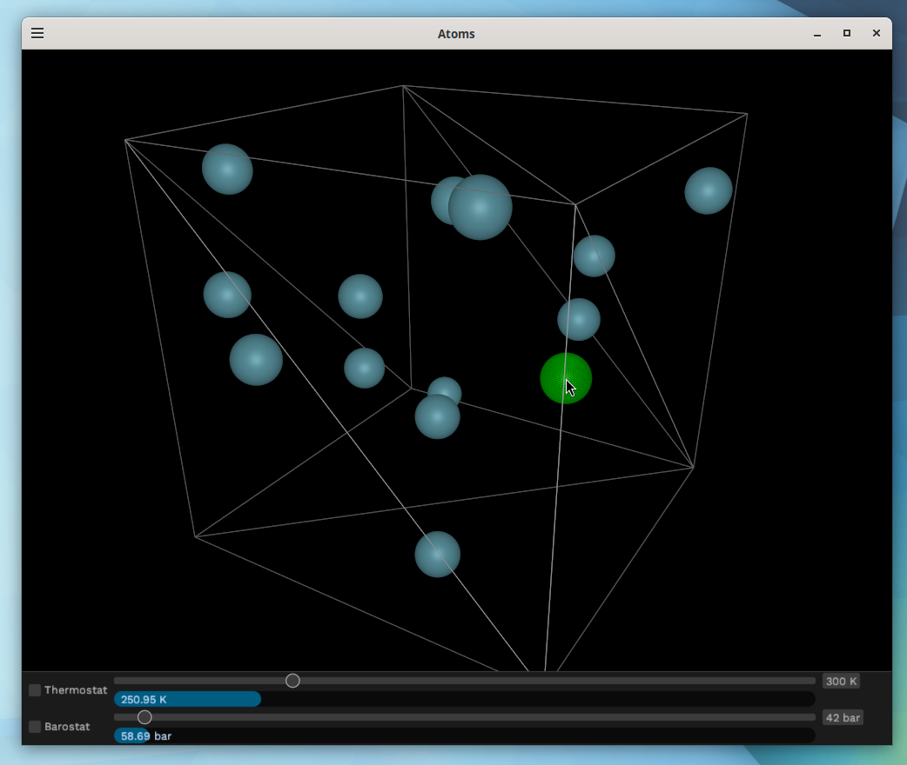

# Atoms

An educational atom sandbox simulator. It is meant to teach people an intuitive understanding on how atoms will behave in different conditions. LAMMPS molecular dynamics simulator is used as the simulation backend. Check [report.md](report.md) for more info.

## How to use

| Button      | Action                         |
| ----------- | ------------------------------ |
| Right click | Enter/exit add mode            |
| Left click  | Add/delete atom                |
| Left drag   | Rotate camera                  |
| Right drag  | Move camera center             |
| Scroll      | Zoom camera/move atom template |
| Space       | Pause simulation               |

## How to build (on Linux)

1. Install [Rust build tools (rustc, cargo)](https://rustup.rs/)
2. Install libgomp if you don't have it already
3. Clone this project `git clone --recurse-submodules https://github.com/Tuupertunut/atoms`
4. `cargo run --release`
